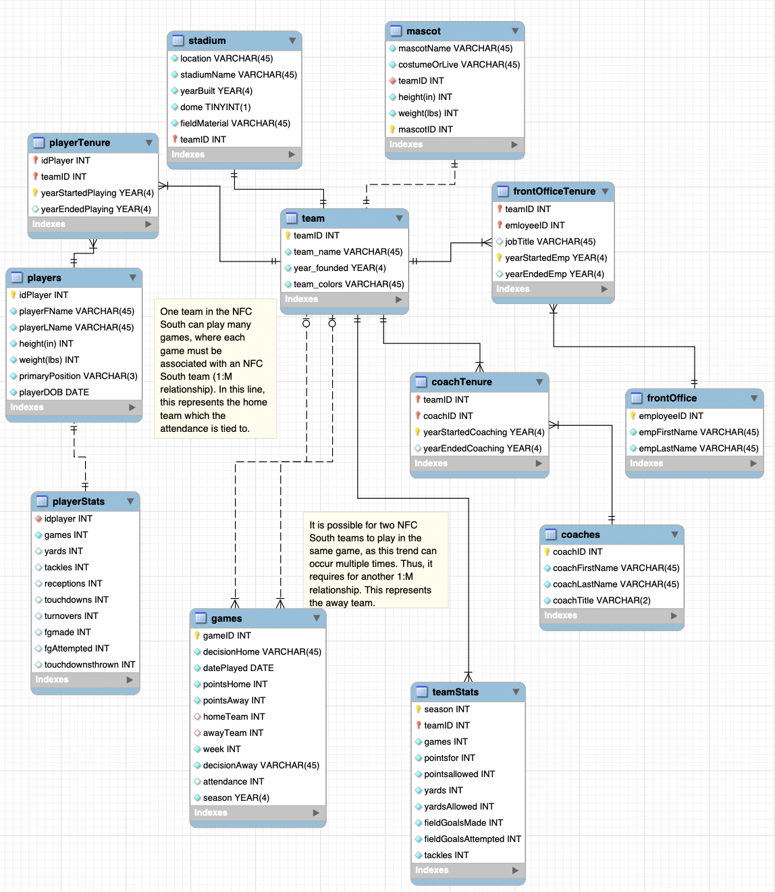
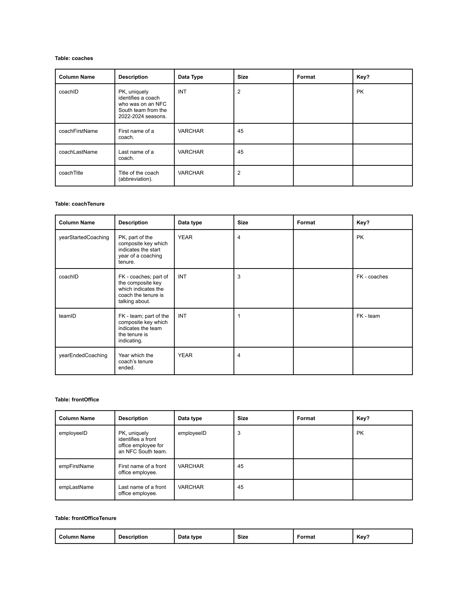
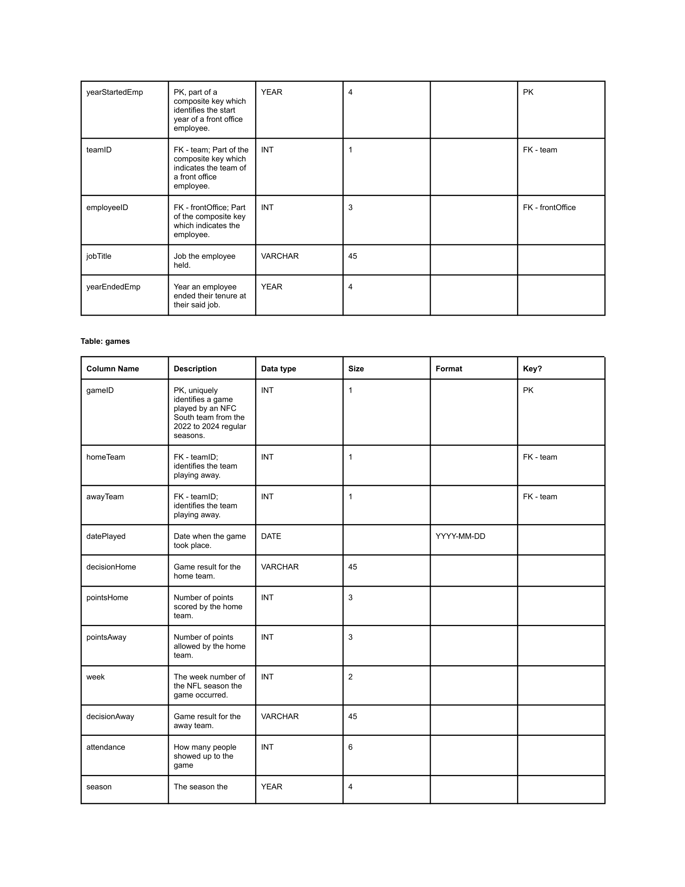
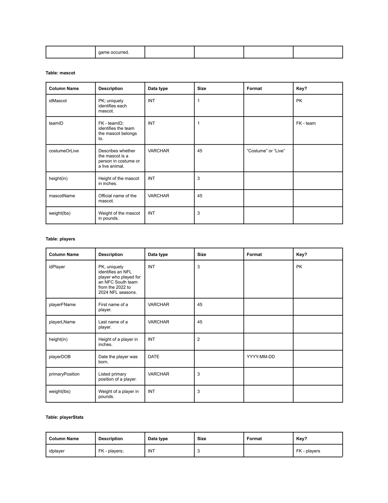
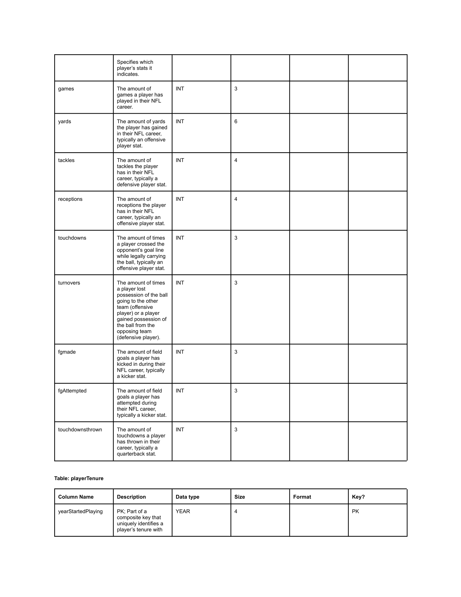
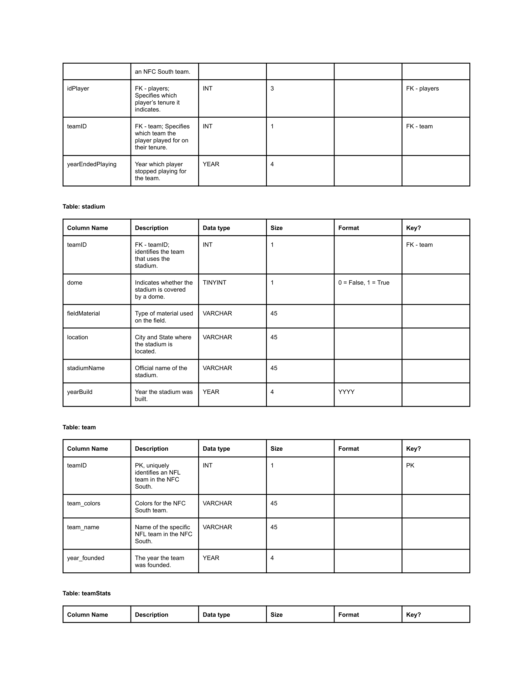
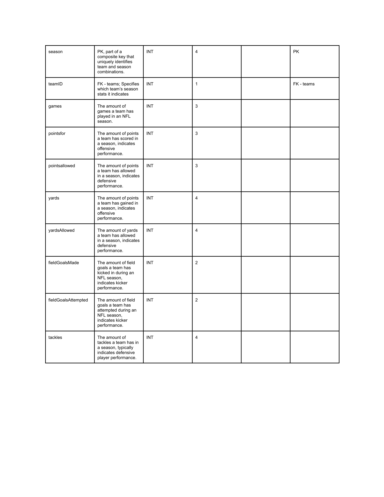

# MIST-4610-Project2-Group-3

## Team Name:
Group 3

## Team Members:

1. Ayanna Patel [@ayannapatel](https://github.com/ayannapatel14)
2. Charles Wu [@charleswu](https://github.com/CharlesWu0109)
3. Dhruv Desai [@druvdesai](https://github.com/Dvdesai)
4. Moheb Veerani [@mohebveerani](https://github.com/mohebveerani-glitch)
5. Emnet Endalk [@emnetendalk](https://github.com/emnete-cell)

## Problem Description: 
The objective of this project is to design and implement a relational database that captures the operations of a professional football organization. The central entity in the model is team, which represents each franchise within the NFC South Division in the NFL. Every team is associated with players, coaches, mascots, and front office employees who contribute to the organization’s success both on and off the field. This model focuses on accurately representing the relationships between these entities, including player tenure, coaching assignments, staff promotions, and team performance in scheduled games. It also accounts for extraneous and external factors such as stadium details, attendance tracking, and inter-division matchups that could influence overall team statistics in the division. By creating and populating this database with realistic sample data, we aim to simulate a working system that supports queries related to player performance and team management efficiency. Ultimately, the database will serve as a foundation for generating insights that can improve strategic decision-making and operational planning within a professional American football franchise.

## Data Model:
Our data model represents the inner workings of NFL teams in the NFC South from the 2022 to 2024 seasons, focusing on how teams, players, coaches, and staff interact throughout each season. At the center of the model is the team entity, which includes details such as the team’s name, year founded, and colors. From this core, multiple relationships branch out to capture the dynamic nature of sports organizations—covering rosters, coaching staff, front-office management, stadium operations, game performance, and overall season performance.

The players table stores detailed information on every athlete in the league. Since players often move between teams over the course of their careers, we introduced a bridge entity called playerTenure to track when each player joins and leaves a specific team. This design allows the database to maintain a clear history of player affiliations without duplicating data. Similarly, the coaches table works alongside the coachTenure entity to document each coach’s time spent with a team, reflecting career progression and transitions across the league.

The playerStats table stores information about the career statistics of players, measured in a few categories like games, touchdowns, tackles, and field goals made. The teamStats table meanwhile, indicates more about a team's season performances rather than an aggregate like a player's career. Yet both tables can be used to indicate a team's relative performance, and potentially help a team find key weaknesses which they can address via trade or free agent signing. 

Front-office operations are represented through the FrontOffice and FrontOfficeTenure entities. These tables capture information about employees’ job titles, start and end years, and any internal promotions—allowing for a comprehensive record of staff history within each organization.

The Stadium table holds information about each team’s home venue, such as its name, location, construction year, and field surface. It connects directly to the Team entity to indicate ownership or association. 

Each team is also linked to at least one Mascot entity, which provides descriptive attributes like mascot type, costume, height, and weight—adding personality to each franchise and capturing an often-overlooked part of team identity.

Game operations, which can indicate a team's individual performance as well as the ability of said team to market such a game, are modeled through the Games table, which records information about regular season matches from the 2022 to 2024 NFL seasons, such as the participating NFC South teams, final score, date of play, outcome, who the home and or away team is, and attendance figures. Since we limited the scope to just teams in the NFC South, it is possible for games 
Thus, the model contains two 1:M relationships. The reason for the one to many relationship is because it shows how a team can play in many games. Furthermore, there needs to be two of the 1:M relationships as one indicates the home team, while the other indicates the away team. If both homeTeam and awayTeam are not null, this indicates a division rivalry matchup

Overall, this database effectively mirrors the complexity of a football organization. It allows for deep insights into performance trends, career timelines, staff movements, and fan engagement. With this relational model, queries can explore everything from historical coaching records to player statistics and stadium attendance, providing a powerful analytical foundation for understanding the operations of NFL teams in the NFC South.

## Data Dictionary:

## Queries:

### 1

__
### 2

__
### 3

__
### 4

__
### 5

## Metabase Visualizations

### (1st visual, based off of one of the queries)
### (2nd visual, based off of another query)
### (3rd visual, based off of a final query)
